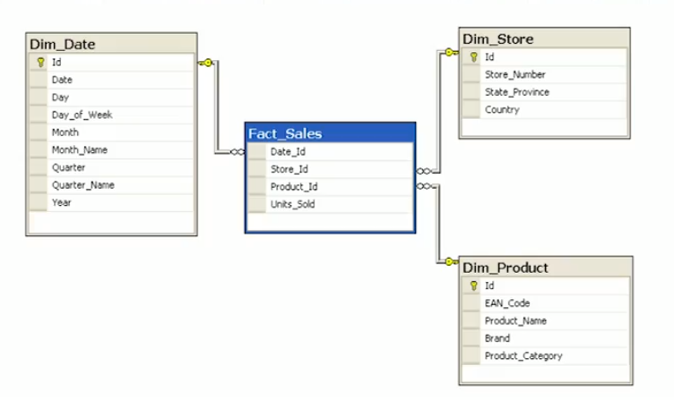
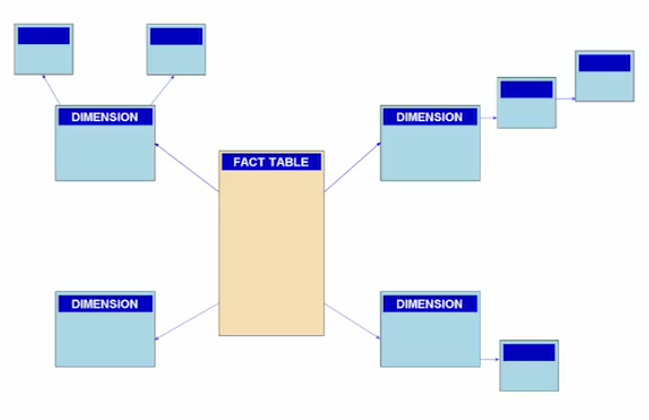

# Data_Engineering
## 1. 数据工程师工具

- Hadoop:分布式系统基础架构
- Spark:专为大规模数据处理而设计的快速通用的计算引擎
- Flink：开源流处理框架，其核心是用Java和Scala编写的分布式流数据流引擎
- Python：编程语言
- Scala：编程语言
- Java：编程语言
- C++：编程语言
- AWS/Redshift：亚马逊云数据库
- Azure：微软云
- Kafka:开源流处理平台,是一种高吞吐量的[分布式](https://baike.baidu.com/item/分布式/19276232)发布订阅消息系统，它可以处理消费者在网站中的所有动作流数据。
- Hive:基于[Hadoop](https://baike.baidu.com/item/Hadoop/3526507)的一个[数据仓库](https://baike.baidu.com/item/数据仓库/381916)工具，用来进行数据提取、转化、加载
- Pig:基于[Hadoop](https://baike.baidu.com/item/Hadoop/3526507)的一个[数据仓库](https://baike.baidu.com/item/数据仓库/381916)工具，用来进行数据提取、转化、加载
- Impala:新型查询系统，它提供SQL语义，能查询存储在Hadoop的HDFS和HBase中的PB级大数据
- Beam:Beam是一个先进的统一处理模型,运行在任何实现了批和流数据处理任务的执行引擎上,它是一个开源的、统一的模型，用于定义批处理和流处理数据并行处理的管道，使用一个开源的Beam SDK你可以构建一个定义管道的程序，然后，这个管道由Beam支持的分布式后端去执行，其中包括**Apache Apex、Apache Flink、Apache Spark和Google Cloud Dataflow**。
- Cloudera:大数据平台
- Hortonworks：大数据平台
- AWS Athena：Amazon Athena 是一种交互式查询服务，可使用此服务通过标准 SQL 在 Amazon S3 中轻松分析数据
- RDBMS:关系数据库管理系统（Relational Database Management System）
- SQL:Structured Query Language

## 2. 数据建模

数据建模过程：概念->逻辑->物理

数据建模不是固定过程。随着新需求和数据的引入，它是迭代的

#### 关系型数据库和NoSQL数据库

| 数据库类型                                            | 特性                                                         | 优点                                                         | 缺点                                                         |
| ----------------------------------------------------- | ------------------------------------------------------------ | ------------------------------------------------------------ | ------------------------------------------------------------ |
| 关系型数据库SQLite、Oracle、mysql、PosgreSQL          | 1、关系型数据库，是指采用了关系模型来组织数据的数据库；<br/>2、关系型数据库的最大特点就是事务的一致性；<br/>3、简单来说，关系模型指的就是二维表格模型，而一个关系型数据库就是由二维表及其之间的联系所组成的一个数据组织。 | 1、容易理解：二维表结构是非常贴近逻辑世界一个概念，关系模型相对网状、层次等其他模型来说更容易理解；<br/>2、使用方便：通用的SQL语言使得操作关系型数据库非常方便；<br/>3、易于维护：丰富的完整性(实体完整性、参照完整性和用户定义的完整性)大大减低了数据冗余和数据不一致的概率；<br/>4、支持SQL，可用于复杂的查询。 | 1、为了维护一致性所付出的巨大代价就是其读写性能比较差；<br/>2、固定的表结构；<br/>3、高并发读写需求；<br/>4、海量数据的高效率读写； |
| 非关系型数据库MongoDb、redis、HBase、Apache Cassandra | 1、使用键值对存储数据；<br/>2、分布式；<br/>3、一般不支持ACID特性；<br/>4、非关系型数据库严格上不是一种数据库，应该是一种数据结构化存储方法的集合。 | 1、无需经过sql层的解析，读写性能很高；<br/>2、基于键值对，数据没有耦合性，容易扩展；<br/>3、存储数据的格式：nosql的存储格式是key,value形式、文档形式、图片形式等等，文档形式、图片形式等等，而关系型数据库则只支持基础类型。 | 1、不提供sql支持，学习和使用成本较高；<br/>2、无事务处理，附加功能bi和报表等支持也不好； |

### 2.1 关系型数据库

#### 事务ACID

数据库事务的属性旨在即使在发生错误或断电时也能确保有效性。

- **原子性：**处理整个交易或不处理任何交易。通常引用的原子交易示例是两个银行帐户之间的货币交易。将钱从一个帐户转到另一个帐户的交易由两个操作组成。首先，您必须在一个帐户中提取资金，其次，您必须将提取的资金保存到第二个帐户中。原子事务（即，当所有操作都发生或什么都不发生时）使数据库保持一致状态。这样可以确保，如果这两个操作（从第一个帐户提取资金或将钱存入第二个帐户）中的任何一个失败，则既不会丢失也不会创建资金。有关此示例的详细说明，请参见[维基百科](https://en.wikipedia.org/wiki/Atomicity_(database_systems))。
- **一致性：**仅将遵守约束和规则的事务写入数据库，否则数据库将保持先前的状态。所有行和表中的数据都应该正确。在[Wikipedia](https://en.wikipedia.org/wiki/Consistency_(database_systems))上查看有关一致性的其他信息。
- **隔离：**交易独立且安全地处理，顺序无关紧要。较低的隔离度使许多用户可以同时访问数据，但是，这也增加了并发影响的可能性（例如，脏读或丢失更新）。另一方面，高级别的隔离减少了并发影响的机会，但也使用了更多的系统资源和彼此阻塞的事务。资料来源：[维基百科](https://en.wikipedia.org/wiki/Isolation_(database_systems))
- **耐用性：**即使在系统出现故障的情况下，完成的事务也会保存到数据库中。通常引用的示例包括跟踪航班座位预订。因此，一旦航班预订记录了确认的座位预订，即使发生系统故障，该座位仍会被预订。资料来源：[Wikipedia](https://en.wikipedia.org/wiki/ACID)。

关系数据库中的所有信息都在逻辑级别上以一种确切的方式显式表示-由表中的值表示

#### 关系数据库的特性：

- **数据模型的标准化：**将数据转换为行和列格式后，数据就已经标准化，您可以使用SQL查询它
- **添加和更改表的灵活性：**关系数据库使您可以灵活地添加表，更改表，添加和删除数据。
- **数据完整性：**数据完整性是使用关系数据库的基础。
- **结构化查询语言（SQL）：**可以使用标准语言以预定义的语言访问数据。
- **简便性：**数据以表格格式系统存储和建模。
- **直观的组织：**电子表格格式是直观的，但是对于关系数据库中的数据建模来说是直观的。

#### 何时不使用关系数据库

- **拥有大量数据：**关系数据库不是分布式数据库，为了进行join处理，关系型数据库不得不把数据存储在同一个服务器内，这不利于数据的分散，因此，它们只能通过在计算机本身中添加更多存储来垂直扩展。一台机器上可以扩展的数量和可以存储的数据量有限。您无法像在NoSQL数据库中那样添加更多计算机。
- **需要能够存储不同的数据类型格式：**关系数据库并非旨在处理非结构化数据。
- **需要高吞吐量-快速读取：**尽管ACID事务带来了好处，但它们也减慢了读取和写入数据的过程。如果您需要非常快速的读写，则使用关系数据库可能不适合您的需求。
- **需要灵活的架构：**灵活的架构可以允许添加不必每行都使用的列，从而节省磁盘空间。
- **需要高可用性：**关系数据库不是分布式的（即使它们是分布式的，它们也具有协调器/工作人员体系结构），但它们只有一个故障点。当该数据库发生故障时，将发生故障切换到备份系统并花费时间。
- **需要水平可伸缩性：**水平可伸缩性是向系统添加更多机器或节点以增加性能和数据空间的能力。

### 2.2 NoSQL数据库

NoSQL = Not Only SQL指的是非关系型的数据库,是对不同于传统的关系型数据库的数据库管理系统的统称。

NoSQL用于超大规模数据的存储。这些类型的数据存储不需要固定的模式，无需多余操作就可以横向扩展

常见的NoSQL数据库：

* 临时性键值存储（Memcached,Redis,DynamoDB），
* 永久性键值存储（Tokyo Tyrant,Flare,ROMA,Redis），
* 面向文档的数据库（MangoDB,CouchDB），
* 面向行的数据库（Cassandra）
* 面向列的数据库（HBase,HyperTable） ,
* 图数据库（Neo4j）

#### 什么时候应该使用NoSQL数据库：

- **需要能够存储不同的数据类型格式**：还创建了NoSQL来处理不同的数据配置：结构化，半结构化和非结构化数据。JSON，XML文档都可以使用NoSQL轻松处理。
- **大量数据**：关系数据库不是分布式数据库，因此，它们只能通过在计算机本身中添加更多存储来垂直扩展。创建NoSQL数据库是为了能够水平扩展。您添加到数据库中的服务器/系统越多，可以承载的数据就越多，它们具有高可用性和低延迟（快速读写）。
- **需要水平可伸缩性**：水平可伸缩性是向系统添加更多机器或节点以增加性能和数据空间的能力
- **需要高吞吐量**：ACID事务带来好处的同时，它们也会减慢读取和写入数据的过程。如果您需要使用关系数据库进行非常快速的读写，则可能不适合您的需求。
- **需要灵活的架构**：灵活的架构可以允许添加不必每行都使用的列，从而节省磁盘空间。
- **需要高可用性**：关系数据库具有单点故障。当该数据库发生故障时，必须进行到备份系统的故障转移并且需要时间。

#### 什么时候不使用NoSQL数据库？

- **当您有一个小型数据集时**：NoSQL数据库是为大型数据集而不是小型数据集创建的，虽然它不是为此创建的。

- **当您需要ACID事务时**：如果您需要一个具有ACID事务的一致数据库，那么大多数NoSQL数据库将无法满足此需求。NoSQL数据库最终是一致的，并且不提供ACID事务。但是，也有例外。一些非关系型数据库（例如MongoDB）可以支持ACID事务。

- **当您需要跨表执行JOINS的能力时**：NoSQL不允许执行JOINS的能力。不允许这样做，因为这将导致全表扫描。

- **如果您希望能够进行汇总和分析**

- **如果您有不断变化的业务需求**：可以进行临时查询，但是很难完成，因为完成了数据模型以修复特定查询

- **如果您的查询不可用并且需要灵活性**：您需要事先查询。如果这些数据不可用，或者您将需要能够灵活地查询数据，则可能需要使用关系数据库

  从v4.0开始，MongoDB在单个副本集中添加了多文档ACID事务。在更高版本的v4.2中，他们在分片/分区部署中添加了多文档ACID事务

  https://blog.csdn.net/qq_30764991/article/details/81564787

#### NoSQL（尤其是Apache Cassandra）的良好用例是：

1. 交易记录（零售，医疗保健）
2. 物联网（IoT）
3. 时间序列数据
4. 任何繁重的工作量都写入数据库（因为Apache Cassandra已针对写入进行了优化）

### 2.3 关系型数据库建模

#### 规范化和非规范化

**规范化**：是通过减少数据副本的数量来尝试提高数据完整性。需要添加或更新的数据将在尽可能少的地方完成。

**非规范化**：试图通过减少表之间的联接数来提高性能（因为联接可能很慢）。数据完整性会受到一些潜在的打击，因为将会有更多的数据副本（以减少JOINS）。

数据库上的JOINS具有出色的灵活性，但是速度非常慢。如果要处理数据库上的大量读取，则可能需要考虑对表进行非规范化。将数据转换为标准化形式，然后继续进行非标准化。因此，非规范化是在规范化之后进行的。 

**规范化目的**：

1. 使数据库摆脱不必要的插入，更新和删除依赖性
2. 在引入新类型的数据时，减少了重构数据库的需求
3. 使关系模型对用户更具参考价值
4. 使数据库与查询统计信息无关

**规范化设计过程**：

**第一范式（1NF）：**

- 原子值：每个单元格包含唯一值和单个值
- 能够添加数据而不更改表
- 将不同的关系分为不同的表
- 保持表之间的关系以及外键

**第二范式（2NF）：**

- 已达到1NF
- 表中的所有列都必须依赖主键

**第三范式（3NF）：**

- 必须为第二范式
- 没有传递依赖
- 请记住，您要维护的可传递依赖关系是要从A-> C获得，您要避免通过B。


**实体关系图**（ERD）以简洁易懂的方式显示数据模型。ERD可以用于任何数据模型，并且不限于STAR或SNOWFLAKE模式。常用工具可用于生成ERD。


**星形模式**是[数据集市](https://en.wikipedia.org/wiki/Data_mart) [模式](https://en.wikipedia.org/wiki/Logical_schema)的最简单样式，并且是最广泛用于开发数据仓库和维度数据集市的方法，星型模式由一个或多个[事实表](https://en.wikipedia.org/wiki/Fact_table)组成，该[事实表](https://en.wikipedia.org/wiki/Fact_table)引用了任意数量的[维表](https://en.wikipedia.org/wiki/Dimension_(data_warehouse))。星型模式是[雪花模式](https://en.wikipedia.org/wiki/Snowflake_schema)的重要特例，对于处理更简单的查询更有效

星型模式好处：1. 可以对表格进行非规范化，2.简化查询，3.快速的数据统计；缺点：1.数据完整性和降低查询灵活性 2.不能处理多对多关系



**雪花模式**是[多维数据库](https://en.wikipedia.org/wiki/Multidimensional_database)中表的[逻辑排列](https://en.wikipedia.org/wiki/Logical_schema)，以使[实体关系](https://en.wikipedia.org/wiki/Entity-relationship_model)图类似于[雪花](https://en.wikipedia.org/wiki/Snowflake) 形状。雪花模式由连接到多个[维度的](https://en.wikipedia.org/wiki/Dimension_(data_warehouse))集中[事实表](https://en.wikipedia.org/wiki/Fact_table)表示，“雪花化”是一种在[星型模式](https://en.wikipedia.org/wiki/Star_schema)中标准化维度表的方法。当所有维度表都完全归一化后，结果结构类似于带有[事实表](https://en.wikipedia.org/wiki/Fact_table)的雪花在中间。雪花背后的原理是通过删除低基数属性并形成单独的表来规范维表



### 2.3 NoSQL 数据库建模

#### CAP定理：（NoSQL 数据库只能保证CAP中的两项）

- **一致性**（**Consistency**:）：从数据库中读取的每个数据都会获取最新（且正确）的数据
- **可用性**（**Availability**）：收到每个请求并给出响应-不能保证数据是最新更新
- **分区容忍**（**Partition Tolerance**）：无论节点之间是否失去网络连接，系统都可以继续工作

 CAP定理意味着，在存在网络分区的情况下，必须在一致性和可用性之间进行选择。” 因此，分布式数据库中没有一致性和可用性之类的东西，因为它必须始终容忍网络问题。您只能具有一致性和分区容限（CP）或可用性和分区容限（AP）

**Apache Cassandra是AP数据库**

Apache Cassandra中的数据建模：

- 非正规化不仅可行-这是必须的
- 必须进行非规范化才能快速读取
- Apache Cassandra已针对快速写入进行了优化
- 总是先考虑查询
- 每个查询一张表是一个不错的策略
- 不允许表之间的联接

在Apache Cassandra中，您希望根据查询对数据建模，如果您的业务需要快速更改需求的调用，则需要创建一个新表来处理数据。这是Apache Cassandra的要求。如果您的企业需要临时查询的电话，这不是Apache Cassandra的优势。但是请记住，创建适合您新查询的新表很容易。


Apache Cassandra组成部分：

分区（Partition）

主键（Primary key）

列（columns）


## 3. 数据仓库

数据仓库，英文名称为Data Warehouse，可简写为[DW](https://baike.baidu.com/item/DW/1264123)或DWH。数据仓库，是为[企业](https://baike.baidu.com/item/企业/707680)所有级别的决策制定过程，提供所有类型数据支持的战略[集合](https://baike.baidu.com/item/集合)。它是单个数据存储，出于分析性报告和决策支持目的而创建。 为需要业务智能的企业，提供指导业务流程改进、监视时间、成本、质量以及控制。

#### 3.1 事实表和维度表

维度表示你要对数据进行分析时所用的一个量, 比如你要分析产品销售情况, 你可以选择按类别来进行分析,或按区域来分析. 这样的按..分析就构成一个维度。前面的示例就可以有两个维度：类型和区域。另外每个维度还可以有子维度（称为属性），例如类别可以有子类型，产品名等属性。

下面是两个常见的维度表结构：

产品维度表：Prod_id, Product_Name, Category, Color, Size, Price
时间维度表：TimeKey, Season, Year, Month, Date

而事实表是数据聚合后依据某个维度生成的结果表。它的结构示例如下：

销售事实表：Prod_id(引用产品维度表), TimeKey(引用时间维度表), SalesAmount(销售总量，以货币计), Unit(销售量)

#### 3.2 ETL

ETL: extract transform load, ETL通常是一个连续的，持续的过程，具有定义明确的工作流。ETL首先从同质或异类数据源中提取数据。然后，对数据进行清洗，丰富，转换和存储，然后再存储到湖泊或数据仓库中

ELT（提取，加载，转换）是ETL的一种变体，其中首先将提取的数据加载到目标系统中。在将数据加载到数据仓库中之后执行转换。当目标系统足够强大时，ELT通常可以很好地工作来处理转换。像Amazon Redshift和Google BigQ这样的分析数据库

#### 3.3 Inmon和Kimball架构

Inmon和Kimball架构最大的不同就是企业数据仓库的模式不同，inmon是采用第三范式的格式，而kimball则采用了多维模型–星型模型，并且还是最低粒度的数据存储。其次是，维度数据仓库可以被分析系统直接访问，当然这种访问方式毕竟在分析过程中很少使用。最后就是数据集市的概念有逻辑上的区别，在kimball的架构中，数据集市有维度数据仓库的高亮显示的表的子集来表示。

https://www.jianshu.com/p/78ba03bcc01e

#### 3.4 OLAP CUBES

Roll-up:上滚，对一个维度进行汇总

Drill-Down:下钻，拆分一个维度

Slice:切片，将维度从N缩小到N-1,方法是将某一维度指定为特定的值，如month='MAR'

Dice:切块，维度相同，方法是将某一维度指定为某些值，如month in ['MAR','FEB']


ROLAP(Relational OLAP):基于关系数据库的OLAP实现

MOLAP(Multidimensional OLAP):基于多维数据组织的OLAP实现

HOLAP(Hybrid OLAP): 基于混合数据组织的OLAP实现


#### **在线分析处理（OLAP-online analytical processing）：**

针对这些工作负载进行了优化的数据库允许进行复杂的分析和临时查询，包括聚合。这些类型的数据库针对读取进行了优化。

#### **在线事务处理（OLTP-online transaction processing）：**

针对这些工作负载进行了优化的数据库允许进行大容量的不太复杂的查询。这些数据库的查询类型为读取，插入，更新和删除。

 **OLTP查询实际上几乎没有聚合，而OLAP则将重点放在聚合上**


## 4. 大数据

### MapReduce

MapReduce编程技术旨在分析整个集群中的海量数据集。 

MapReduce的灵感来源于函数式语言（比如[Lisp](https://baike.baidu.com/item/Lisp/22083)）中的内置函数map和reduce。函数式语言也算是阳春白雪了，离我们普通开发者总是很远。简单来说，在函数式语言里，map表示对一个列表（List）中的每个元素做计算，[reduce](https://baike.baidu.com/item/reduce)表示对一个列表中的每个元素做迭代计算。它们具体的计算是通过传入的函数来实现的，map和reduce提供的是计算的框架。

简单说来，一个映射函数就是对一些独立元素组成的概念上的列表（例如，一个测试成绩的列表）的每一个元素进行指定的操作（比如前面的例子里，有人发现所有学生的成绩都被高估了一分，它可以定义一个“减一”的映射函数，用来修正这个错误。）。事实上，每个元素都是被独立操作的，而原始列表没有被更改，因为这里创建了一个新的列表来保存新的答案。这就是说，Map操作是可以高度并行的，这对高性能要求的应用以及[并行计算](https://baike.baidu.com/item/并行计算)领域的需求非常有用。

而化简操作指的是对一个列表的元素进行适当的合并（继续看前面的例子，如果有人想知道班级的平均分该怎么做？它可以定义一个化简函数，通过让列表中的元素跟自己的相邻的元素相加的方式把列表减半，如此[递归](https://baike.baidu.com/item/递归)运算直到列表只剩下一个元素，然后用这个元素除以人数，就得到了平均分。）。虽然他不如映射函数那么并行，但是因为化简总是有一个简单的答案，大规模的运算相对独立，所以化简函数在高度并行环境下也很有用。

这样我们就可以把MapReduce理解为，把一堆杂乱无章的数据按照某种特征归纳起来，然后处理并得到最后的结果。Map面对的是杂乱无章的互不相关的数据，它解析每个数据，从中提取出key和value，也就是提取了数据的特征。经过MapReduce的Shuffle阶段之后，在Reduce阶段看到的都是已经归纳好的数据了，在此基础上我们可以做进一步的处理以便得到结果。

### hadoop

 Hadoop MapReduce是编程技术的特定实现。

### HDFS

HDFS（Hadoop Distributed File System）是Hadoop生态系统中的文件系统

### Spark

Hadoop生态系统是一种比Spark生态系统稍老的技术。通常，Hadoop MapReduce比Spark慢，因为Hadoop在中间步骤中将数据写出到磁盘，而Spark尝试将中间结果尽可能保留在内存中。

#### RDD

RDD是数据的低层抽象。在Spark的第一个版本中，您直接使用RDD。您可以将RDD视为分布在各种计算机上的长列表。尽管数据框架和SQL更容易，但仍可以将RDD用作Spark代码的一部分

#### DAG

DAG，全称 Directed Acyclic Graph， 中文为：有向无环图。在 Spark 中， 使用 DAG 来描述我们的计算逻辑。

DAG 是一组顶点和边的组合。顶点代表了 RDD(弹性分布式数据集)， 边代表了对 RDD 的一系列操作。

DAG Scheduler 会根据 RDD 的 transformation 动作，将 DAG 分为不同的 stage，每个 stage 中分为多个 task，这些 task 可以并行运行。

DAG 的出现主要是为了解决 Hadoop MapReduce 框架的局限性。

主要有两个：

- 每个 MapReduce 操作都是相互独立的，HADOOP不知道接下来会有哪些Map Reduce。
- 每一步的输出结果，都会持久化到硬盘或者 HDFS 上。

在某些迭代的场景下，MapReduce 框架会对硬盘和 HDFS 的读写造成大量浪费。而且每一步都是堵塞在上一步中，所以当我们处理复杂计算时，会需要很长时间，但是数据量却不大

**DAG工作流程**：

1. 解释器是第一层。Spark 通过使用Scala解释器，来解释代码，并会对代码做一些修改。
2. 在Spark控制台中输入代码时，Spark会创建一个 operator graph， 来记录各个操作。
3. 当一个 RDD 的 Action 动作被调用时， Spark 就会把这个 operator graph 提交到 DAG scheduler 上。
4. DAG Scheduler 会把 operator graph 分为各个 stage。 一个 stage 包含基于输入数据分区的task。DAG scheduler 会把各个操作连接在一起。
5. 这些 Stage 将传递给 Task Scheduler。Task Scheduler 通过 cluster manager 启动任务。Stage 任务的依赖关系， task scheduler 是不知道的。
6. 在 slave 机器上的 Worker 们执行 task。

RDD 的 transformation 分为两种：窄依赖（如map、filter），宽依赖（如reduceByKey）。 窄依赖不需要对分区数据进行 shuffle ，而宽依赖需要。所以窄依赖都会在一个 stage 中， 而宽依赖会作为 stage 的交界处。每个 RDD 都维护一个 metadata 来指向一个或多个父节点的指针以及记录有关它与父节点的关系类型。

#### Maps和Lambda，关联数据处理函数

```python
import pyspark
sc = pyspark.SparkContext(appName="maps_and_lazy_evaluation_example")
# config = pyspark.SparkConf().setAppName("name").setMaster("local")
# sc = pyspark.SparkContext(conf=config)
log_of_songs = [
        "Despacito",
        "Nice for what",
        "No tears left to cry",
        "Despacito",
        "Havana",
        "In my feelings",
        "Nice for what",
        "despacito",
        "All the stars"
]
distributed_song_log = sc.parallelize(log_of_songs)
def convert_song_to_lowercase(song):
    return song.lower()
distributed_song_log.map(convert_song_to_lowercase).collect()
#or
distributed_song_log.map(lambda x: x.lower()).collect()
```

```python
import pyspark
from pyspark import SparkConf
from pyspark.sql import SparkSession
spark = SparkSession \
    .builder \
    .appName("Our first Python Spark SQL example") \
    .getOrCreate()
spark.sparkContext.getConf().getAll()
path = "data/sparkify_log_small.json"
user_log = spark.read.json(path)
user_log.printSchema()
user_log.describe()
user_log.show(n=1)
user_log.take(5)
out_path = "data/sparkify_log_small.csv"
user_log.write.save(out_path, format="csv", header=True)
user_log_2 = spark.read.csv(out_path, header=True)
user_log_2.printSchema()
user_log_2.take(2)
user_log_2.select("userID").show()
user_log_2.take(1)
```

udf

```python
from pyspark.sql import SparkSession
from pyspark.sql.functions import udf
from pyspark.sql.types import StringType
from pyspark.sql.types import IntegerType
from pyspark.sql.functions import desc
from pyspark.sql.functions import asc
from pyspark.sql.functions import sum as Fsum
import datetime
import numpy as np
import pandas as pd
import matplotlib.pyplot as plt
from pyspark.sql import Window

spark = SparkSession \
    .builder \
    .appName("Wrangling Data") \
    .getOrCreate()
path = "data/sparkify_log_small.json"
user_log = spark.read.json(path)
user_log.take(5)
user_log.printSchema()
user_log.describe().show()
user_log.describe("artist").show()
user_log.describe("sessionId").show()
user_log.select("page").dropDuplicates().sort("page").show()
user_log.select(["userId", "firstname", "page", "song"]).where(user_log.userId == "1046").collect()
#Calculating Statistics by Hour
get_hour = udf(lambda x: datetime.datetime.fromtimestamp(x / 1000.0). hour)
user_log = user_log.withColumn("hour", get_hour(user_log.ts))
user_log.head()
songs_in_hour = user_log.filter(user_log.page == "NextSong").groupby(user_log.hour).count().orderBy(user_log.hour.cast("float"))
songs_in_hour.show()
songs_in_hour_pd = songs_in_hour.toPandas()
songs_in_hour_pd.hour = pd.to_numeric(songs_in_hour_pd.hour)
plt.scatter(songs_in_hour_pd["hour"], songs_in_hour_pd["count"])
plt.xlim(-1, 24);
plt.ylim(0, 1.2 * max(songs_in_hour_pd["count"]))
plt.xlabel("Hour")
plt.ylabel("Songs played");
#Drop Rows with Missing Values
user_log_valid = user_log.dropna(how = "any", subset = ["userId", "sessionId"])
user_log_valid.count()
user_log.select("userId").dropDuplicates().sort("userId").show()
user_log_valid = user_log_valid.filter(user_log_valid["userId"] != "")
user_log_valid.count()
#Users Downgrade Their Accounts
user_log_valid.filter("page = 'Submit Downgrade'").show()
user_log.select(["userId", "firstname", "page", "level", "song"]).where(user_log.userId == "1138").collect()
flag_downgrade_event = udf(lambda x: 1 if x == "Submit Downgrade" else 0, IntegerType())
user_log_valid = user_log_valid.withColumn("downgraded", flag_downgrade_event("page"))
user_log_valid.head()
windowval = Window.partitionBy("userId").orderBy(desc("ts")).rangeBetween(Window.unboundedPreceding, 0)
user_log_valid = user_log_valid.withColumn("phase", Fsum("downgraded").over(windowval))
user_log_valid.select(["userId", "firstname", "ts", "page", "level", "phase"]).where(user_log.userId == "1138").sort("ts").collect()
```

```python
songplays_table = songplays_table\
    .join(time_table, songplays_table.start_time == time_table.start_time, how='inner') \
    .select('songplay_id', songplays_table.start_time, 'user_id', 'level', 'song_id', \
    'artist_id', 'session_id', 'location', 'user_agent', songplays_table.year, songplays_table.month)
songplays_table = df.join(song_df, df.song == song_df.title, how='inner')\                   .select(monotonically_increasing_id().alias('songplay_id'), \                                                              col('start_time').alias('start_time'),\                                                                col('userId').alias('user_id'),\                                                                'level', \                                                               'song_id', \                                                               'artist_id', \                                                                col('sessionId').alias('session_id'), \                                                               'location', \                                                                col('userAgent').alias('user_agent'))
```


#### spark context和spark session关系

SparkSession是Spark 2.0引如的新概念。SparkSession为用户提供了统一的切入点，来让用户学习spark的各项功能。
 在spark的早期版本中，SparkContext是spark的主要切入点，由于RDD是主要的API，我们通过sparkcontext来创建和操作RDD。对于每个其他的API，我们需要使用不同的context。例如，对于Streaming，我们需要使用StreamingContext；对于sql，使用sqlContext；对于Hive，使用hiveContext。但是随着DataSet和DataFrame的API逐渐成为标准的API，就需要为他们建立接入点。所以在spark2.0中，引入SparkSession作为DataSet和DataFrame API的切入点，SparkSession封装了SparkConf、SparkContext和SQLContext。为了向后兼容，SQLContext和HiveContext也被保存下来。
SparkSession实质上是SQLContext和HiveContext的组合

#### DataFrames操作

- `select()`：返回具有选定列的新DataFrame
- `filter()`：使用给定条件过滤行
- `where()`：只是它的别名 `filter()`
- `groupBy()`：使用指定的列对DataFrame进行分组，因此我们可以对它们进行聚合
- `sort()`：返回按指定列排序的新DataFrame。默认情况下，第二个参数“升序”为True。
- `dropDuplicates()`：返回一个具有基于所有列或仅列的子集的唯一行的新DataFrame
- `withColumn()`：通过添加列或替换具有相同名称的现有列来返回新的DataFrame。第一个参数是新列的名称，第二个参数是如何计算它的表达式。
- `agg({"salary": "avg", "age": "max"})`计算平均工资和最大年龄。
- col("numWords")  选择一列

spark SQL提供了内置的方法最常见的聚合，例如`count()`，`countDistinct()`，`avg()`，`max()`，`min()`，等在pyspark.sql.functions模块

在Spark SQL中，我们可以使用pyspark.sql.functions模块中的udf方法**定义自己的函数**。UDF返回的变量的默认类型为字符串。如果我们想返回其他类型，则需要使用pyspark.sql.types模块中的不同类型来显式地返回。

**窗口函数**是一种组合DataFrame中行范围值的方法。在定义窗口时，我们可以选择如何（使用`partitionBy`方法）对行进行排序和分组以及我们要使用的窗口宽度（由`rangeBetween`或描述`rowsBetween`）

#### spark SQL

```python
from pyspark.sql import SparkSession
from pyspark.sql.functions import udf
from pyspark.sql.types import StringType
from pyspark.sql.types import IntegerType
from pyspark.sql.functions import desc
from pyspark.sql.functions import asc
from pyspark.sql.functions import sum as Fsum
import datetime
import numpy as np
import pandas as pd
import matplotlib.pyplot as plt

spark = SparkSession \
    .builder \
    .appName("Data wrangling with Spark SQL") \
    .getOrCreate()
path = "data/sparkify_log_small.json"
user_log = spark.read.json(path)
user_log.take(1)
user_log.printSchema()
user_log.createOrReplaceTempView("user_log_table") #creates a temporary view against which you can run SQL queries
spark.sql("SELECT * FROM user_log_table LIMIT 2").show()
spark.sql('''
          SELECT * 
          FROM user_log_table 
          LIMIT 2
          '''
          ).show()
spark.sql('''
          SELECT COUNT(*) 
          FROM user_log_table 
          '''
          ).show()
spark.sql('''
          SELECT userID, firstname, page, song
          FROM user_log_table 
          WHERE userID == '1046'
          '''
          ).collect()
spark.sql('''
          SELECT DISTINCT page
          FROM user_log_table 
          ORDER BY page ASC
          '''
          ).show()
#User Defined Functions
spark.udf.register("get_hour", lambda x: int(datetime.datetime.fromtimestamp(x / 1000.0).hour))
spark.sql('''
          SELECT *, get_hour(ts) AS hour
          FROM user_log_table 
          LIMIT 1
          '''
          ).collect()
songs_in_hour = spark.sql('''
          SELECT get_hour(ts) AS hour, COUNT(*) as plays_per_hour
          FROM user_log_table
          WHERE page = "NextSong"
          GROUP BY hour
          ORDER BY cast(hour as int) ASC
          '''
          )
songs_in_hour.show()
# Converting Results to Pandas
songs_in_hour_pd = songs_in_hour.toPandas()
print(songs_in_hour_pd)
```

#### 从s3读取数据

**sqlContext.jsonFile(“/path/to/myDir”)** is deprecated from spark 1.6 instead use **spark.read.json(“/path/to/myDir”) or spark.read.format(“json”).load(“/path/to/myDir”)**

### 数据湖

数据湖概念的诞生，源自企业面临的一些挑战，如数据应该以何种方式处理和存储。最开始，企业对种类庞杂的应用程序的管理都经历了一个比较自然的演化周期。

最开始的时候，每个应用程序会产生、存储大量数据，而这些数据并不能被其他应用程序使用，这种状况导致**数据孤岛**的产生。随后数据集市应运而生，应用程序产生的数据存储在一个集中式的数据仓库中，可根据需要导出相关数据传输给企业内需要该数据的部门或个人

**然而数据集市只解决了部分问题。**剩余问题，包括数据管理、数据所有权与访问控制等都亟须解决，因为企业寻求获得更高的使用有效数据的能力。

为了解决前面提及的各种问题，**企业有很强烈的诉求搭建自己的数据湖**，数据湖不但能存储传统类型数据，也能存储任意其他类型数据，并且能在它们之上做进一步的处理与分析，产生最终输出供各类程序消费。

**数据湖是一个存储企业的各种各样原始数据的大型仓库，其中的数据可供存取、处理、分析及传输。**

### kafka

Apache Kafka是使用Scala和Java编写的Apache软件基金会的**开源流处理软件平台**。

Kafka是一种高吞吐量的[分布式](https://baike.baidu.com/item/分布式/19276232)发布订阅消息系统，它可以处理消费者在网站中的所有动作流数据。 这种动作（网页浏览，搜索和其他用户的行动）是在现代网络上的许多社会功能的一个关键因素。

Kafka的目的是通过[Hadoop](https://baike.baidu.com/item/Hadoop)的并行加载机制来统一线上和离线的消息处理，也是为了通过[集群](https://baike.baidu.com/item/集群/5486962)来提供实时的消息。

### 数据管道

data pipeline:是处理数据的一系列步骤

