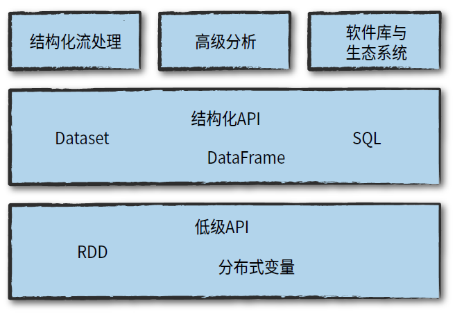
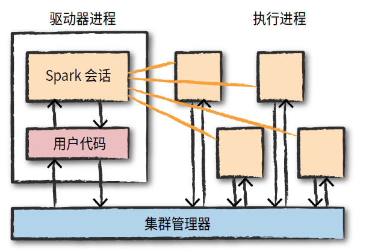

- [Hadoop-](https://hadoop.apache.org/)用于大数据存储和数据分析的工具生态系统。Hadoop是一个比Spark更旧的系统，但仍被许多公司使用。Spark和Hadoop之间的主要区别在于它们如何使用内存。Hadoop将中间结果写入磁盘，而Spark尝试尽可能将数据保留在内存中。这使得Spark在许多用例中都更快。
- **Hadoop MapReduce-**一种用于并行处理和分析大型数据集的系统。
- **Hadoop YARN-**资源管理器，可跨集群调度作业。管理器跟踪可用的计算机资源，然后将这些资源分配给特定任务。
- **Hadoop分布式文件系统（HDFS）** -一种大数据存储系统，可将数据拆分为多个块，并将这些块存储在计算机集群中。
- **Apache Pig-**一种类似于SQL的语言，在Hadoop MapReduce上运行
- **Apache Hive-**在Hadoop MapReduce上运行的另一个类似SQL的界面
- EC2 : Elastic Compute Cloud
- EMR: Elastic MapReduce是AWS提供的一项服务，它使您（用户）无需手动安装每台机器的Spark及其依赖项
- M family: multipurpose family 多用途组合
- R family:optimized for Ram
- C family:optimized for CPU

# Spark与Hadoop有何关系？

本课程的重点是Spark，它是另一个大数据框架。Spark包含用于数据分析，机器学习，图形分析和实时数据流的库。Spark通常比Hadoop快。这是因为Hadoop将中间结果写入磁盘，而Spark尝试将中间结果尽可能保留在内存中。

Hadoop生态系统包括一个称为HDFS（Hadoop分布式文件系统）的分布式文件存储系统。另一方面，Spark不包含文件存储系统。您可以在HDFS之上使用Spark，但不必这样做。Spark可以从其他来源（例如[Amazon S3）](https://aws.amazon.com/s3/)读取数据。

Spark具有一个称为[Spark Streaming](https://spark.apache.org/docs/latest/streaming-programming-guide.html)的流媒体库，尽管它不像其他某些流媒体库那样流行和快速。其他流行的流媒体库包括[Storm](http://storm.apache.org/)和 [Flink](https://flink.apache.org/)。本课程不会涉及流媒体，但是您可以通过以下链接来了解有关这些技术的更多信息。


MapReduce是一种用于处理大型数据集的编程技术。“ Hadoop MapReduce”是此编程技术的特定实现。

该技术的工作原理是首先分割大型数据集，然后将数据分布在整个群集中。在映射步骤中，将分析每个数据并将其转换为（键，值）对。然后，将这些键值对在整个群集中混排，以便所有键都在同一台计算机上。在reduce步骤中，将具有相同键的值组合在一起。

尽管Spark没有实现MapReduce，但是您可以编写行为与map-reduce范例相似的Spark程序。


spark适用场景 ：

- [数据分析](http://spark.apache.org/sql/)
- [机器学习](http://spark.apache.org/mllib/)
- [流媒体](http://spark.apache.org/streaming/)
- [图分析](http://spark.apache.org/graphx/)

# Spark的局限性

Spark有一些限制。

Spark Streaming的等待时间至少为500毫秒，因为它对记录的微批次进行操作，而不是一次处理一个记录。诸如[Storm](http://storm.apache.org/)，[Apex](https://apex.apache.org/)或[Flink之](https://flink.apache.org/)类的本地流工具可以降低此延迟值，并且可能更适合于低延迟应用程序。Flink和Apex也可以用于批处理计算，因此，如果您已经将它们用于流处理，则无需将Spark添加到您的技术堆栈中。

Spark的另一个限制是它选择了机器学习算法。当前，Spark仅支持与输入数据大小成线性比例的算法。通常，尽管有许多项目将Spark与Tensorflow和其他深度学习工具集成在一起，但深度学习也不可用。


请记住，Spark不是数据存储系统，除了Spark以外，还有许多其他工具可用于处理和分析大型数据集。您可能听说过较新的数据库存储系统，例如[HBase](https://hbase.apache.org/)或[Cassandra](http://cassandra.apache.org/)。还有分布式SQL引擎，例如[Impala](https://impala.apache.org/)和[Presto](https://prestodb.io/)，根据您在Python和SQL方面的经验，其中许多技术都使用您可能已经熟悉的查询语法。


spark DAG(Directed Acyclical Graph) 数据配方

```python
spark = SparkSession \
    .builder \
    .appName("Wrangling Data") \
    .getOrCreate()
```

- `select()`：返回具有选定列的新DataFrame
- `filter()`：使用给定条件过滤行
- `where()`：只是它的别名 `filter()`
- `groupBy()`：使用指定的列对DataFrame进行分组，因此我们可以对它们进行聚合
- `sort()`：返回按指定列排序的新DataFrame。默认情况下，第二个参数“升序”为True。
- `dropDuplicates()`：返回一个具有基于所有列或仅列的子集的唯一行的新DataFrame
- `withColumn()`：通过添加列或替换具有相同名称的现有列来返回新的DataFrame。第一个参数是新列的名称，第二个参数是如何计算它的表达式。
- `agg({"salary": "avg", "age": "max"})`计算平均工资和最大年龄。

spark SQL提供了内置的方法最常见的聚合，例如`count()`，`countDistinct()`，`avg()`，`max()`，`min()`，等在pyspark.sql.functions模块

在Spark SQL中，我们可以使用pyspark.sql.functions模块中的udf方法定义自己的函数。UDF返回的变量的默认类型为字符串。如果我们想返回其他类型，则需要使用pyspark.sql.types模块中的不同类型来显式地返回。

RDD是数据的低层抽象。在Spark的第一个版本中，您直接使用RDD。您可以将RDD视为分布在各种计算机上的长列表。尽管数据框架和SQL更容易，但仍可以将RDD用作Spark代码的一部分。

# spark从S3中读数据

```python
df = spark.read.load(“s3://my_bucket/path/to/file/file.csv”)
# 如果我们使用的是spark，并且存储桶下面的所有对象都具有相同的架构，则可以执行以下操作
df = spark.read.load(“s3://my_bucket/”)
```


# HDFS和AWS S3之间的区别

- **AWS S3**是一个**对象存储系统**，它使用键值对（即存储区和键）存储数据，而**HDFS**是一种**实际的分布式文件系统**，可以保证容错能力。HDFS通过具有重复因素来实现容错能力，这意味着默认情况下，它将在集群中的3个不同节点上复制相同文件（可以将其配置为不同的重复次数）。
- HDFS通常**安装在本地系统中**，并且传统上让工程师在现场维护和诊断Hadoop生态系统，这**比在云上存储数据要花费更多**。由于**位置**的**灵活性**和**降低的维护成本**，云解决方案变得更加流行。借助您可以在AWS内使用的广泛服务，S3比HDFS更受欢迎。
- 由于**AWS S3是二进制对象存储库**，因此它可以**存储各种格式**，甚至图像和视频。HDFS将严格要求某种文件格式-流行的选择是**avro**和**parquet**，它们具有相对较高的压缩率，这对于存储大型数据集很有用。


* Spark Accumulators
* Spark Broadcast
* spark WebUI

# Spark

Apache Spark是一个在集群上运行的统一计算引擎以及一组并行数据处理软件库

  

**统一平台**：Spark通过统一计算引擎和利用一套统一的API，支持广泛的数据分析任务，从简单的数据加载，到SQL查询，再到机器学习和流式计算

**计算引擎**:在Spark致力于统一平台的同时，它也专注于计算引擎，Spark从存储系统加载数据并对其执行计算，加载结束时不负责永久存储，也不偏向于使用某一特定的存储系统，主要原因是大多数数据已经存在于混合存储系统
中，而移动这些数据的费用非常高，因此Spark专注于对数据执行计算，而不考虑数据存储于何处

**配套的软件库**：Spark包括SQL和处理结构化数据的库（Spark SQL）、机器学习库（MLlib）、流处理库（Spark Streaming和较新的结构化流式处理），以及图分析（GraphX）的库。除了这些库之外，还有数百种开源外部库，从用于各种存储系统的连接器到机器学习算法。spark-packages.org（https://spark-packages.org/）上提供了一个外部库的索引。


**Spark的基本架构**：Spark管理和协调跨多台计算机的计算任务。Spark用来执行计算任务的若干台机器由像Spark的集群管理器、YARN或Mesos这样的集群管理器管理，然后我们提交Spark应用程序给这些集群管理器，它们将计算资源分配给应用程序，以便完成我们的工作。

**Spark应用程序**：Spark应用程序由一个驱动器进程和一组执行器进程组成。**驱动进程**运行main()函数，位于集群中的一个节点上，它负责三件事：维护Spark应用程序的相关信息；回应用户的程序或输入；分析任务并分发给若干执行器进行处理。**执行器**负责执行驱动器分配给它的实际计算工作，这意味着每个执行器只负责两件事：执行由驱动器分配给它的代码，并将该执行器的计算状态报告给运行驱动器的节点。




## SparkSession

```python
from pyspark.sql import SparkSession

spark = SparkSession \
    .builder \
    .appName("Python Spark SQL basic example") \
    .config("spark.some.config.option", "some-value") \
    .getOrCreate()
```

## DataFrame

DataFrame是最常见的结构化API，简单来说它是包含行和列的数据表。列和列类型的一些规则被称为**模式**（schema）。与电子表格不同的是：电子表格位于一台计算机上，而Spark DataFrame可以跨越数千台计算机。

我们可以非常容易地将Pandas（Python） DataFrame转换为Spark DataFrame或将R DataFrame转换为Spark DataFrame。

DataFrame的分区定义了DataFrame以及Dataset在集群上的物理分布，而划分模式定义了partition的分配方式，你可以自定义分区的方式，也可以采取随机分配的方式。

Spark中的DataFrame和Dataset代表不可变的数据集合，可以通过它指定对特定位置数据的操作，该操作将以惰性评估方式执行。当对DataFrame执行动作操作时，将触发Spark执行具体转换操作并返回结果，这些代表了如何操纵行和列来计算出用户期望结果的执行计划

```python
# spark is an existing SparkSession
df = spark.read.json("examples/src/main/resources/people.json")
# Displays the content of the DataFrame to stdout
df.show()
df.printSchema()  #表结构
df.select("name").show()
df.select(df['name'], df['age'] + 1).show()
df.filter(df['age'] > 21).show()   
df.groupBy("age").count().show()

# 创建dataframe
training = spark.createDataFrame([
    (0, "a b c d e spark", 1.0),
    (1, "b d", 0.0),
    (2, "spark f g h", 1.0),
    (3, "hadoop mapreduce", 0.0)
], ["id", "text", "label"])

flightData2015 = spark\
.read\
.option("inferSchema", "true")\
.option("header", "true")\
.csv("/data/flight-data/csv/2015-summary.csv")
```

### 模式Schema

Schema定义了DataFrame的列名和类型，可以**手动定义**或者**从数据源读取模式**（通常定义为模式读取）。

一个模式是由许多字段构成的StructType。这些字段即为StructField，具有名称、类型、布尔标志（该标志指定该列是否可以包含缺失值或空值），并且用户可指定与该列关联的元数据（metadata）。元数据存储着有关此列的信息。模式还可以包含其他的StructType（Spark的复杂类型）

如果（在运行时）数据的类型与定义的schema模式不匹配，Spark将抛出一个错误。

```python
from pyspark.sql.types import StructField, StructType, StringType, LongType
myManualSchema = StructType([
StructField("DEST_COUNTRY_NAME", StringType(), True),
StructField("ORIGIN_COUNTRY_NAME", StringType(), True),
StructField("count", LongType(), False, metadata={"hello":"world"})
])
df = spark.read.format("json").schema(myManualSchema)\
    .load("/data/flight-data/json/2015-summary.json")
```

### 列和表达式

```python
from pyspark.sql.functions import col, column
col("someColumnName")
df.col("count")  #获取列内容
from pyspark.sql.functions import expr
expr("(((someCol + 5) * 200) - 6) < otherCol")
```

### 记录和行

在Spark中，DataFrame的每一行都是一个记录，而记录是Row类型的对象。Spark使用列表达式操纵Row类型对象。Row对象内部其实是字节数组，但是Spark没有提供访问这些数组的接口，因此我们只能使用列表达式去操纵。

当使用DataFrame时，向驱动器请求行的命令总是返回一个或多个Row类型的行数据

需要注意的是，只有DataFrame具有模式，行对象本身没有模式，这意味着，如果你手动创建Row对象，则必须按照该行所附属的DataFrame的列顺序来初始化Row对象

```python
# 在DataFrame上调用first()来查看一行
df.first()
from pyspark.sql import Row
myRow = Row("Hello", None, 1, False)
myRow[0]
myRow[2]
```

```python
# 使用私有数据和自定义模式创建dataframe
from pyspark.sql import Row
from pyspark.sql.types import StructField, StructType, StringType, LongType
myManualSchema = StructType([
StructField("some", StringType(), True),
StructField("col", StringType(), True),
StructField("names", LongType(), False)
])
myRow = Row("Hello", None, 1)
myDf = spark.createDataFrame([myRow], myManualSchema)
myDf.show()
```


### 数据类型

| 数据类型      | Python的值类型                                               | 获取或者创建数据类型的API                                    |
| ------------- | ------------------------------------------------------------ | ------------------------------------------------------------ |
| ByteType      | int或long。注意：数字在运行时转换为1字节 <br/>的带符号整数。 确保数字在-128~127的范围内 | ByteType()                                                   |
| ShortType     | int或long。注意：数字在运行时将转换为2字 <br/>节带符号的整数。 确保数字在-32768到<br/>32767的范围内 | ShortType()                                                  |
| IntegerType   | int或long。注意：Python对“整数”有一个<br/>宽松的定义。如果使用IntegerType()，那么太<br/>大的数字将被Spark SQL拒绝。在这种情况下，<br/>最好使用LongType() | IntegerType()                                                |
| LongType      | long。注意：数字在运行时将转换为8字节有符 <br/>号整数。确保数字在-9223372036854775808~<br/>9223372036854775807范围内。否则，请将<br/>数据类型转换为decimal.Decimal，并使用<br/>DecimalType | IntegerType()                                                |
| FloatType     | float型。注意：在运行时，数字将被转换为4 <br/>字节的单精度浮点数 | FloatType()                                                  |
| DoubleType    | float型                                                      | DoubleType()                                                 |
| DecimalType   | decimal.Decimal                                              | DecimalType()                                                |
| StringType    | string                                                       | StringType()                                                 |
| BinaryType    | bytearray                                                    | BinaryType()                                                 |
| BooleanType   | Bool                                                         | BooleanType()                                                |
| TimestampType | datetime.datetime                                            | TimestampType()                                              |
| DateType      | datetime.date                                                | DateType()                                                   |
| ArrayType     | List，tuple或array                                           | ArrayType（elementType，<br/>[containsNull]）。注意：<br/>containsNull的默认值为<br/>True |
| MapType       | 字典                                                         | MapType（keyType，<br/>valueType，<br/>[valueContainsNull]）。<br/>注意：valueContainsNull<br/>的默认值为True |
| StructType    | 列表或元组                                                   | StructType（fields）。注<br/>意： fields是一个包含多<br/>个StructFiled的list，并且<br/>任意两个StructField不能<br/>同名 |
| StructField   | 该字段对应的Python数据类型（例如，int是<br/>IntegerType的StructField） | StructField（name，<br/>dataType，[nullable]）。<br/>注意：nullable指定该<br/>field是否可以为空值，默<br/>认值为True |

### select和selectExpr

Select函数和selectExpr函数支持在DataFrame上执行类似数据表的SQL查询

```python
# SELECT DEST_COUNTRY_NAME FROM dfTable LIMIT 2
df.select("DEST_COUNTRY_NAME").show(2)
# SELECT DEST_COUNTRY_NAME, ORIGIN_COUNTRY_NAME FROM dfTable LIMIT 2
df.select("DEST_COUNTRY_NAME", "ORIGIN_COUNTRY_NAME").show(2)

from pyspark.sql.functions import expr, col, column
df.select(
expr("DEST_COUNTRY_NAME"),
col("DEST_COUNTRY_NAME"),
column("DEST_COUNTRY_NAME"))\
.show(2)
```

expr是我们目前使用到的最灵活的引用方式。它能够引用一列，也可以引用对列进行操纵的字符串表达式。

```python
# SELECT DEST_COUNTRY_NAME as destination FROM dfTable LIMIT 2
df.select(expr("DEST_COUNTRY_NAME AS destination")).show(2)
df.select(expr("DEST_COUNTRY_NAME as destination").alias("DEST_COUNTRY_NAME")).show(2)
```

因为select后跟着一系列expr是非常常见的写法，所以Spark有一个有效地描述此操作序列的接口：selectExpr，它可能是最常用的接口

```python
df.selectExpr("DEST_COUNTRY_NAME as newColumnName", "DEST_COUNTRY_NAME").show(2)
# SELECT *,(DEST_COUNTRY_NAME=ORIGIN_COUNTRY_NAME) as withinCountry FROM dfTable LIMIT 2
df.selectExpr(
"*", # all original columns
"(DEST_COUNTRY_NAME = ORIGIN_COUNTRY_NAME) as withinCountry")\
.show(2)
# SELECT avg(count), count(distinct(DEST_COUNTRY_NAME)) FROM dfTable LIMIT 2
df.selectExpr("avg(count)", "count(distinct(DEST_COUNTRY_NAME))").show(2)
```

### 字面量（literal）

有时候需要给Spark传递显式的值，它们只是一个值而非新列。这可能是一个常量值，或接下来需要比较的值。我们的方式是通过字面量（literal）传递

```python
from pyspark.sql.functions import lit
# SELECT *, 1 as One FROM dfTable LIMIT 2
df.select(expr("*"), lit(1).alias("One")).show(2)
```

### 添加列

```python
# SELECT *, 1 as numberOne FROM dfTable LIMIT 2
df.withColumn("numberOne", lit(1)).show(2)
df.withColumn("withinCountry", expr("ORIGIN_COUNTRY_NAME == DEST_COUNTRY_NAME")).show(2)
# 使用withcolumn重命名列
df.withColumn("Destination", expr("DEST_COUNTRY_NAME")).columns
# 重命名列
df.withColumnRenamed("DEST_COUNTRY_NAME", "dest").columns
```

### 删除列

```python
dfWithLongColName.drop("ORIGIN_COUNTRY_NAME", "DEST_COUNTRY_NAME")
```

### 更改列的类型

```python
df.withColumn("count2", col("count").cast("long"))
```

### 转义符

你可能会遇到列名中包含空格或者连字符等保留字符，要处理这些保留字符意味着要适当地对列名进行转义。在Spark中，我们通过使用反引号（`）字符来实现。

```python
dfWithLongColName.selectExpr(
"`This Long Column-Name`",
"`This Long Column-Name` as `new col`")\
.show(2)
```

### 区分大小写

Spark默认是不区分大小写的，但可以通过如下配置使Spark区分大小写：

```python
# set spark.sql.caseSensitive true
spark.conf.set("spark.sql.caseSensitive", "true")
```

### 过滤操作（where和filter）

where和filter可以执行相同的操作，接受相同参数类型,一般使用where，因为这更像SQL语法

```python
df.filter(col("count") < 2).show(2)
df.where("count < 2").show(2)
```

我们可能本能地想把多个过滤条件放到一个表达式中，尽管这种方式可行，但是并不总有效。因为Spark会同时执行所有过滤操作，不管过滤条件的先后顺序，因此当你想指定多个AND过滤操作时，只要按照先后顺序以链式的方式把这些过滤条件串联起来

```python
# SELECT * FROM dfTable WHERE count < 2 AND ORIGIN_COUNTRY_NAME != "Croatia" LIMIT 2
df.where(col("count") < 2).where(col("ORIGIN_COUNTRY_NAME") != "Croatia")\
.show(2)
```

### 去重(distinct)

是一个转换操作

```python
df.select("ORIGIN_COUNTRY_NAME", "DEST_COUNTRY_NAME").distinct().count()
```

### 随机抽样（sample）

```python
seed = 5
# 指定是否放回抽样， true为有放回的抽样（可以有重复样本），false为无放回的抽样（无重复样本）
withReplacement = False 
fraction = 0.5
df.sample(withReplacement, fraction, seed).count()
```

### 随机分割（randomSplit）

当需要将原始DataFrame随机分割成多个分片时，可以使用随机分割。这通常是在机器学习算法中，用于分割数据集来创建训练集、验证集和测试集

```python
seed = 5
dataFrames = df.randomSplit([0.25, 0.75], seed)
dataFrames[0].count() > dataFrames[1].count()
```

### union操作-连接和追加行

DataFrame是不可变的，这意味着用户不能向DataFrame追加行。如果想要向DataFrame追加行，你必须将原始的DataFrame与新的DataFrame联合起来，即union操作，也就是拼接两个DataFrame。若想联合两个DataFrame，你必须确保它们具有相同的模式和列数，否则联合操作将会失败

```python
from pyspark.sql import Row
schema = df.schema
newRows = [
  Row("New Country", "Other Country", 5L),
  Row("New Country 2", "Other Country 3", 1L)
]
parallelizedRows = spark.sparkContext.parallelize(newRows)
newDF = spark.createDataFrame(parallelizedRows, schema)
df.union(newDF)\
  .where("count = 1")\
  .where(col("ORIGIN_COUNTRY_NAME") != "United States")\
  .show()
```

### 排序

sort和orderBy方法是相互等价的操作，执行的方式也一样。它们均接收列表达式和字符串，以及多个列。默认设置是按升序排序

```python
df.sort("count").show(5)
df.orderBy("count", "DEST_COUNTRY_NAME").show(5)
df.orderBy(col("count"), col("DEST_COUNTRY_NAME")).show(5)
from pyspark.sql.functions import desc, asc
df.orderBy(expr("count desc")).show(2)
df.orderBy(col("count").desc(), col("DEST_COUNTRY_NAME").asc()).show(2)
```

出于性能优化的目的，最好是在进行别的转换之前，先对每个分区进行内部排序。可以使用sortWithinPartitions方法实现这一操作

```python
spark.read.format("json").load("/data/flight-data/json/*-summary.json")\
.sortWithinPartitions("count")
```

asc_nulls_first指示空值安排在升序排列的前面，

desc_nulls_first指示空值安排在降序排列的前面

asc_nulls_last指示空值安排在升序排列的后面

desc_nulls_last指示空值安排在降序排列的后面

### limit

```python
# SELECT * FROM dfTable LIMIT 6
df.limit(5).show()
# SELECT * FROM dfTable ORDER BY count desc LIMIT 6
df.orderBy(expr("count desc")).limit(6).show()
```

### 重分区和合并

另一个重要的优化是根据一些经常过滤的列对数据进行分区，控制跨群集数据的物理布局，包括分区方案和分区数

不管是否有必要，重新分区都会导致数据的全面洗牌。如果将来的分区数大于当前的分区数，或者当你想要基于某一组特定列来进行分区时，通常只能重新分区

```python
df.rdd.getNumPartitions() #1
df.repartition(5)
# 如果你知道你经常按某一列执行过滤操作，则根据该列进行重新分区是很有必要的
df.repartition(col("DEST_COUNTRY_NAME"))
# 还可以指定你想要的分区数量
df.repartition(5, col("DEST_COUNTRY_NAME"))
```

合并操作（coalesce）不会导致数据的全面洗牌，但会尝试合并分区。

```python
df.repartition(5, col("DEST_COUNTRY_NAME")).coalesce(2)
```

### 驱动器获取行

Spark的驱动器维护着集群状态，有时候你需要让驱动器收集一些数据到本地，这样你可以在本地机器上处理它们。

到目前为止，我们并没有明确定义这个操作。但我们使用了几种不同的方法来实现完全相同的效果。下面的代码示例使用collect函数从整个DataFrame中获取所有数据，使用take函数选择前N行，并使用show函数打印一些行。

```python
collectDF = df.limit(10)
collectDF.take(5) # 获取整数行
collectDF.show() # 更友好的打印
collectDF.show(5, False)
collectDF.collect()
```

为了遍历整个数据集，还有一种让驱动器获取行的方法，即toLocalIterator函数。toLocalIterator函数式一个迭代器，将每个分区的数据返回给驱动器。这个函数允许你以串行的方式一个一个分区地迭代整个数据集

```python
collectDF.toLocalIterator()
```

### 其它方法

alias或contains

### 聚合操作（aggregation）

### 窗口函数（window function）

### 连接操作（join）

## 数据分区

为了让多个执行器并行地工作,S p a r k将数据分解成多个数据块,每个数据块叫做一个分区。分区是位于集群中的一台物理机上的多行数据的集合,DataFrame的分区也说明了在执行过程中,数据在集群中的物理分布。如果只有一个
分区,即使拥有数千个执行器,S p a r k也只有一个执行器在处理数据。类似地,如果有多个分区,但只有一个执行器,那么S p a r k仍然只有一个执行器在处理数据,就是因为只有一个计算资源单位
值得注意的是,当使用DataFrame时,(大部分时候)你不需要手动操作分区,只需指定数据的高级转换操作,然后Spark决定此工作如何在集群上执行

## Dataset

Dataset类似于RDD，但是，它们不使用Java序列化或Kryo，而是使用专用的[Encoder](http://spark.apache.org/docs/latest/api/scala/org/apache/spark/sql/Encoder.html)对对象进行序列化以进行处理或通过网络传输。虽然编码器和标准序列化都负责将对象转换为字节，但是编码器是动态生成的代码，并使用一种格式，该格式允许Spark执行许多操作，如过滤，排序和哈希处理，而无需将字节反序列化为对象

dataset只有java和scala接口

## SQL

使用Spark SQL，你可以将任何DataFrame注册为数据表或视图（临时表），并使用纯SQL对它进行查询。编写SQL查询或编写DataFrame代码并不会造成性能差异，它们都会被“编译”成相同的底层执行计划。

```python
# Register the DataFrame as a SQL temporary view
df.createOrReplaceTempView("people")

sqlDF = spark.sql("SELECT * FROM people")
sqlDF.show()
```

## 操作

操作分为**转换操作**和**动作操作**

### 转换操作

要“ 更改”DataFrame，你需要告诉Spark如何修改它以执行你想要的操作，这个过程被称为转换。

如： divisBy2 = myRange.where("number % 2 = 0")

这些转换并没有实际输出，这是因为我们仅指定了一个抽象转换。在我们调用一个动作操作之前，Spark不会真的执行转换操作。

转换操作是使用Spark表达业务逻辑的核心，有两类转换操作：第一类是指定**窄依赖关系**的转换操作，第二类是指定**宽依赖关系**的转换操作。

窄依赖关系（narrow dependency）的转换操作（我们称之为窄转换）是每个输入分区仅决定一个输出分区的转换。在前面的代码片段中，where语句指定了一个窄依赖关系，其中一个分区最多只会对一个输出分区有影响。Spark将自动执行流水线处理，这意味着如果我们在DataFrame上指定了多个过滤操作，它们将全部在内存中执行。

宽依赖关系（wide dependency）的转换（或宽转换）是每个输入分区决定了多个输出分区。这种宽依赖关系的转换经常被称为洗牌（shuffle）操作，它会在整个集群中执行互相交换分区数据的功能。当我们执行shuffle操作时，Spark将结果写入磁盘

### 惰性评估

惰性评估（lazy evaluation）的意思就是等到绝对需要时才执行计算。

一个很好的例子就是DataFrame的谓词下推（predicate pushdown），假设我们构建一个含有多个转换操作的Spark作业，并在最后指定了一个过滤操作，假设这个过滤操作只需要数据源（输入数据）中的某一行数据，则最有效的方法是在最开始仅访问我们需要的单个记录，Spark会通过自动下推这个过滤操作来优化整个物理执行计划。

### 动作操作

转换操作使我们能够建立逻辑转换计划。为了触发计算，我们需要运行一个动作操作 （action）。

有三类动作：

* 在控制台中查看数据的动作。
* 在某个语言中将数据汇集为原生对象的动作。如collect操作
*  写入输出数据源的动作

**可以通过调用explain函数观察到Spark正在创建一个执行计划,并且可以看到这个计划将会怎样在集群上执行,调用某个DataFrame的explain操作会显示DataFrame的来源(即Spark是如何执行查询操作的)**
```python
flightData2015.sort("count").explain()
```

## 全局临时视图

Spark SQL中的临时视图是会话作用域的，如果创建它的会话终止，它将消失。如果要在所有会话之间共享一个临时视图并保持活动状态，直到Spark应用程序终止，则可以创建全局临时视图。全局临时视图与系统保留的`global_temp`数据库相关联，我们必须使用限定名称来引用它，例如`SELECT * FROM global_temp.view1`。

```python
# Register the DataFrame as a global temporary view
df.createGlobalTempView("people")

# Global temporary view is tied to a system preserved database `global_temp`
spark.sql("SELECT * FROM global_temp.people").show()
# Global temporary view is cross-session
spark.newSession().sql("SELECT * FROM global_temp.people").show()
```


## 标量函数

- [数组函数](http://spark.apache.org/docs/latest/sql-ref-functions-builtin.html#array-functions)
- [Map功能](http://spark.apache.org/docs/latest/sql-ref-functions-builtin.html#map-functions)
- [日期和时间戳功能](http://spark.apache.org/docs/latest/sql-ref-functions-builtin.html#date-and-timestamp-functions)
- [JSON函数](http://spark.apache.org/docs/latest/sql-ref-functions-builtin.html#json-functions)

## 类聚集函数

- [汇总功能](http://spark.apache.org/docs/latest/sql-ref-functions-builtin.html#aggregate-functions)
- [视窗功能](http://spark.apache.org/docs/latest/sql-ref-functions-builtin.html#window-functions)

## UDF（用户定义的函数）

- [标量用户定义函数（UDF）](http://spark.apache.org/docs/latest/sql-ref-functions-udf-scalar.html)
- [用户定义的聚合函数（UDAF）](http://spark.apache.org/docs/latest/sql-ref-functions-udf-aggregate.html)
- [与Hive UDF / UDAF / UDTF集成](http://spark.apache.org/docs/latest/sql-ref-functions-udf-hive.html)

```python
get_hour = udf(lambda x: datetime.datetime.fromtimestamp(x / 1000.0). hour)
user_log = user_log.withColumn("hour", get_hour(user_log.ts))
user_log.head()
```

## 配置

默认情况下，shuffle操作会输出200个shuffle分区，我们将此值设置为5以减少shuffle输出分区的数量：

```python
spark.conf.set("spark.sql.shuffle.partitions", "5")
flightData2015.sort("count").take(2)
```


## 读CSV文件

```python
spark = SparkSession.builder.appName("myproject").getOrCreate()
flightData2015 = spark.read\
	.option("inferSchema", "true").option("header", "true")\
	.csv("/data/flight-data/csv/2015-summary.csv")
df.printSchema()
df.show(5)

staticDataFrame = spark.read.format("csv")\
.option("header", "true")\
.option("inferSchema", "true")\
.load("/data/retail-data/by-day/*.csv")
```

## spark-submit

spark-submit轻松地将测试级别的交互式程序转化为生产级别的应用程序。sparksubmit将你的应用程序代码发送到一个集群并在那里执行，应用程序将一直运行，直到它（完成任务后）正确退出或遇到错误。你的程序可以在集群管理器的支持下进行，包括Standalone，Mesos和YARN等。

spark-submit提供了若干控制选项，你可以指定应用程序需要的资源，以及应用程序的运行方式和运行参数等

你可以使用Spark支持的任何语言编写应用程序，然后提交它执行

```python
./bin/spark-submit \
--master local \
./examples/src/main/python/pi.py 10
```

## Dataset：类型安全的结构化API

Dataset，用于在Java和Scala中编写静态类型的代码。Dataset API在Python和R中不可用，因为这些语
言是动态类型的。

**暂时跳过**

